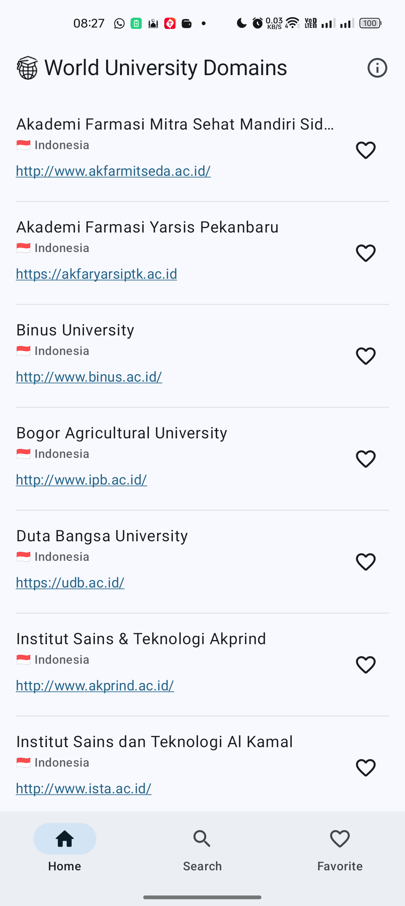
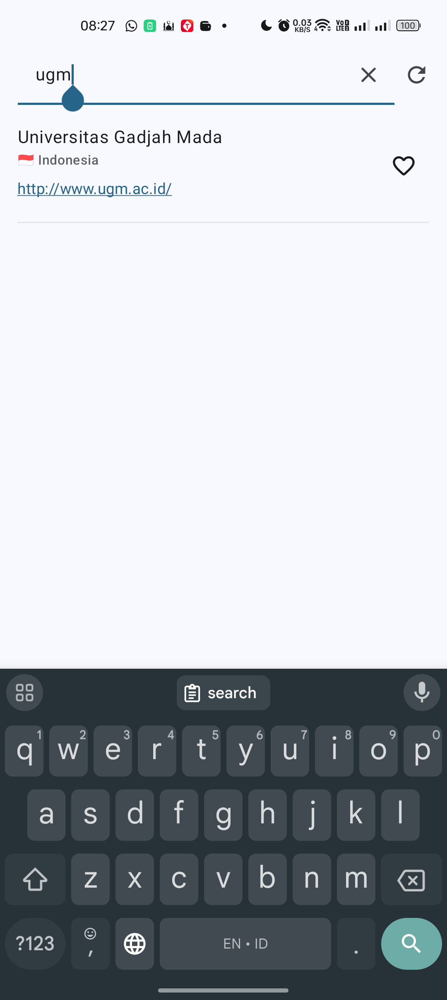
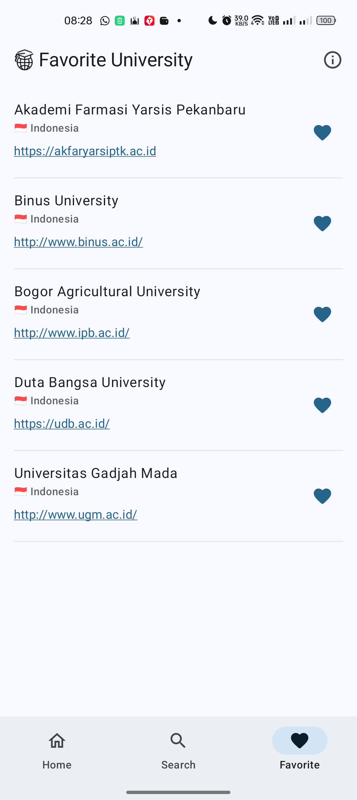

# University Domains

## Project Description
University Domains is a simple Android application for searching and exploring university domains. The app demonstrates modern Android development practices using Jetpack Compose, MVVM architecture, and various Android libraries.

### API Source
This project uses the [University Domains List API](https://github.com/Hipo/university-domains-list-api?tab=readme-ov-file) provided by Hipo. Currently, the app only supports universities in Indonesia.

## Screenshots
Here are some screenshots of the application:
| **Home Screen**      | **Search Screen**    | **Favorite Screen** |
|-----------------------|----------------------|-----------------------|
|  |  |  |

## APIs Used
The project leverages the following endpoints from the University Domains List API:

| Feature             | API Endpoint                             |
|---------------------|------------------------------------------|
| List Universities   | `/search?country=indonesia`              |
| Search Universities | `/search?name={query}&country=indonesia` |

## Tech Stack
The project utilizes the following libraries and tools:

| Library/Tool        | Version & Link                                                                               | Included |
|---------------------|----------------------------------------------------------------------------------------------|----------|
| Kotlin              | [2.0.20](https://kotlinlang.org/)                                                            | ✔️       |
| Kotlin Coroutines   | [1.9.0](https://kotlinlang.org/docs/coroutines-overview.html)                                | ✔️       |
| Jetpack Compose     | [2024.04.01](https://developer.android.com/jetpack/compose)                                  | ✔️       |
| Retrofit            | [2.11.0](https://square.github.io/retrofit/)                                                | ✔️       |
| OkHttp              | [4.12.0](https://square.github.io/okhttp/)                                                  | ✔️       |
| Room                | [2.6.1](https://developer.android.com/jetpack/androidx/releases/room)                       | ✔️       |
| DataStore           | [1.1.1](https://developer.android.com/topic/libraries/architecture/datastore)               | ✔️       |
| Hilt                | [2.52](https://developer.android.com/jetpack/androidx/releases/hilt)                        | ✔️       |

## Best Practices
This project adheres to modern Android development practices:
- **Architecture Pattern:** MVVM (Model-View-ViewModel) for separation of concerns and scalability.
- **Dependency Injection:** Hilt for managing dependencies and improving testability.
- **Offline Support:** Room for local storage and offline capabilities.
- **Error Handling:** Graceful error handling for network and database operations.
- **Testing:**
    - Unit Tests for validating business logic.
    - UI Tests for user interaction using Jetpack Compose testing utilities.
- **Git Workflow:** Organized commits with meaningful messages for better collaboration.
- **Design Guidelines:** Compliant with Material Design for a polished user experience.

## How to Run the Project
1. Clone or download the source code.
2. Open the project in Android Studio.
3. Sync Gradle files to download dependencies.
4. Run the app on an emulator or physical device with a minimum SDK of 26.
   
## How to Run Tests

### Unit Tests
To run unit tests:

1. Open the project in Android Studio.
2. Navigate to the `test` directory.
3. Right-click and select **Run 'Tests in ...'**.

### UI Tests
To run UI tests:

1. Open the project in Android Studio.
2. Navigate to the `androidTest` directory.
3. Right-click and select **Run 'Tests in ...'**.
4. Ensure an emulator or physical device is running.

---

This project showcases clean architecture, testability, and adherence to Android development best practices. Currently, it focuses on universities in Indonesia, but it can be extended to support other countries in the future.
